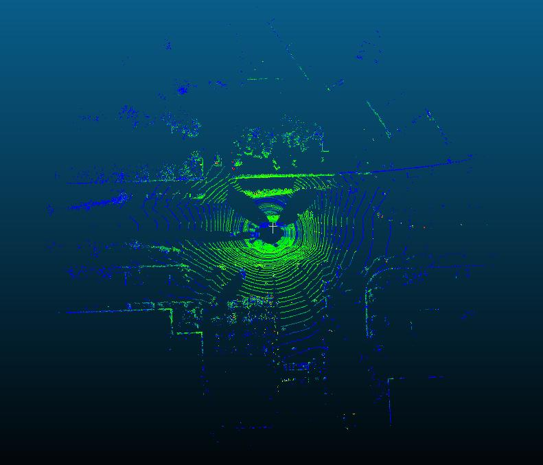
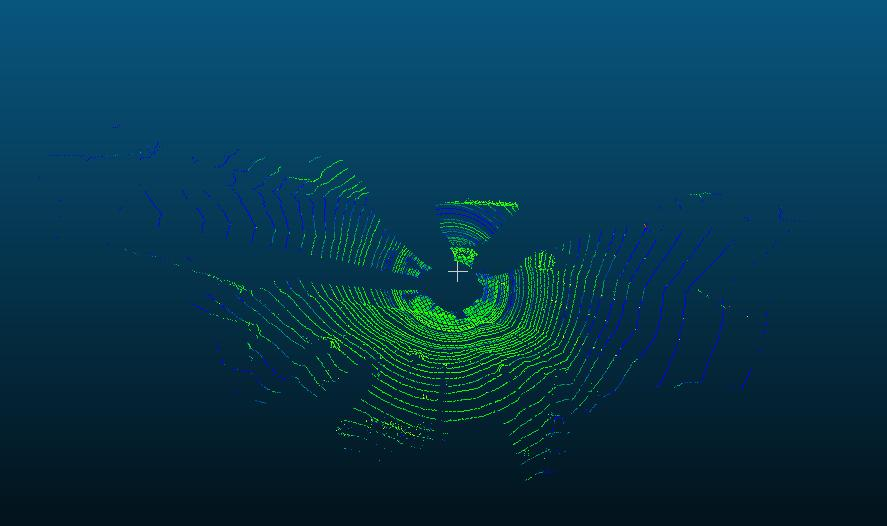
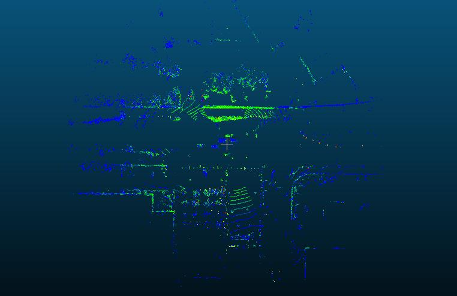

# FloorSegmentation



This Code Is From The Paper: [Fast Segmentation of 3D Point Clouds for Ground Vehicles(2010 IEEE Intelligent Vehicles Symposium)](https://ieeexplore.ieee.org/document/5548059)

Implementation of the ground segmentation algorithm proposed in 
```
@inproceedings{himmelsbach2010fast,
  title={Fast segmentation of 3d point clouds for ground vehicles},
  author={Himmelsbach, Michael and Hundelshausen, Felix V and Wuensche, H-J},
  booktitle={Intelligent Vehicles Symposium (IV), 2010 IEEE},
  pages={560--565},
  year={2010},
  organization={IEEE}
}
```

## How To Build 

```bash
 cd build 
 cmake ..
 make 

```

It's All.

## How To Run 

```bash
./test_floorseg 
```

And Then, You Can Find new pcd Files In The Build File.

### Visualize Floor & Not-Floor Point Cloud.





### Ground Condition
- **sensor_height**  Sensor height above ground.
- **max_dist_to_line**  maximum vertical distance of point to line to be considered ground.
- **max_slope**  Maximum slope of a line.
- **max_error_square**  Maximum error a point is allowed to have in a line fit.
- **max_start_height**  Maximum height difference between new point and estimated ground height to start a new line.
- **long_threshold**  Distance after which the max_height condition is applied.
- **max_long_height**  Maximum height difference between line points when they are farther apart than *long_threshold*.
- **line_search_angle**  How far to search in angular direction to find a line. A higher angle helps fill "holes" in the ground segmentation.
- **r_min_square**  Distance at which segmentation starts.
- **r_max_square**  Distance at which segmentation ends.
- **n_bins**  Number of radial bins.
- **n_segments**  Number of angular segments.
- **n_threads**  Number of threads to use.
- **visualize** Visualize the segmentation result. **ONLY FOR DEBUGGING.** Do not set true during online operation.


### More Details Write In Blog Address

* analyze this algorithm: https://blog.csdn.net/Small_Munich/article/details/108086888