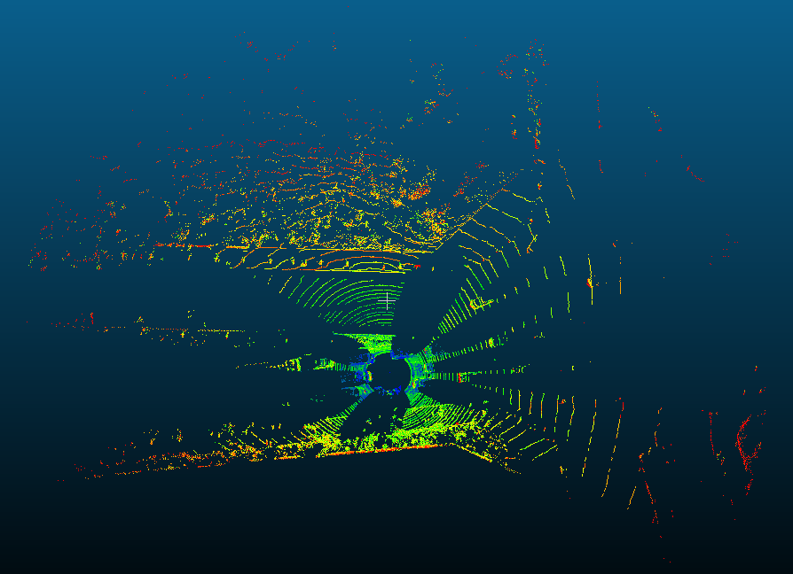
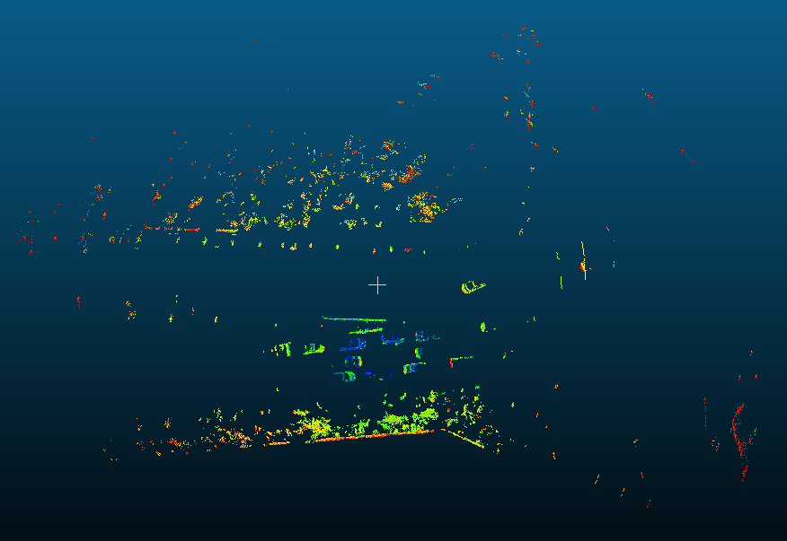
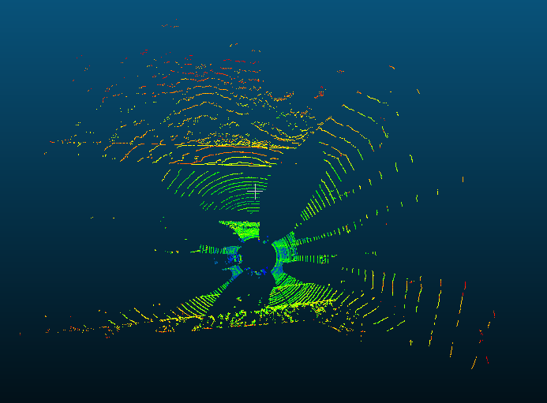

# FloorSegmentation



This Code Is From The Paper: [Gaussian-Process-Based Real-Time Ground Segmentation for Autonomous Land Vehicles](https://www.researchgate.net/publication/271739703_Gaussian-Process-Based_Real-Time_Ground_Segmentation_for_Autonomous_Land_Vehicles)

Implementation of the ground segmentation algorithm proposed in 
```
@inproceedings{ 
title={Gaussian-Process-Based Real-Time Ground Segmentation for Autonomous Land Vehicles[J]},
author={Chen T , Dai B , Wang R , et al.},
booktitle={Journal of Intelligent and Robotic Systems}, 
year={2014}, 
pages={76(3-4):563-582}
}
```

## How To Build 

```bash
 cd build 
 cmake ..
 make 

```

It's All.

## How To Run 

```bash
./test_floorseg 
```

And Then, You Can Find new pcd Files In The Build File.

### Visualize Floor & Not-Floor Point Cloud.





### Ground Condition
- **sensor_height**  Sensor height above ground.
- **max_bin_points**  maximum bin points number.
- **num_seed_points**  number of seed points.
- **num_bins_a**  number of devided(by angle) bins. number_bins_devided_by_angle_.
- **num_bins_l**  number of devided(by range) bins. number_bins_devided_by_range_.
- **p_l**  length parameter, how close points have to be in the GP model to correlate them.
- **p_sf**  scaling on the whole covariance function.
- **p_sn**  the expected noise for the mode.
- **p_tmodel**  the required confidence required in order to consider.
- **p_tdata**  scaled value that is required for a query point to be considered ground.
- **p_tg**  ground height threshold.
- **max_seed_range**  maximum seed points range.
- **max_seed_height**  maximum seed points height.


### More Details Write In Blog Address

* analyze this algorithm: 